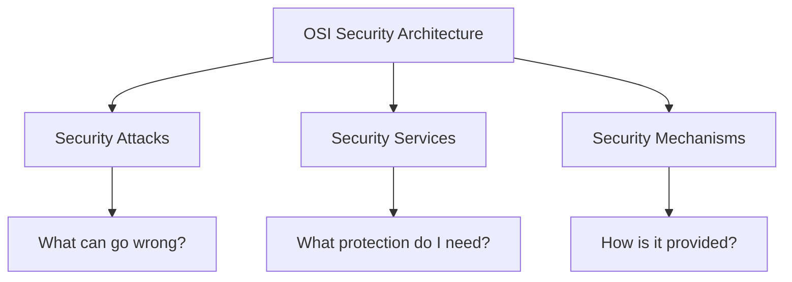

# 02 — OSI Security Architecture

After the basic cryptography terms, we moved to the **OSI Security Architecture**.

The part that helped me understand it was not memorizing three headings. I wrote three questions instead:

```text
What can go wrong?
What protection do I need?
How is that protection provided?
```

Those three questions map to:

```text
Security Attacks
Security Services
Security Mechanisms
```

---

## 1. The three parts



The relationship I keep using is:

```text
Attack → creates the security problem
Service → says what protection I want
Mechanism → is how I provide that protection
```

---

## 2. Security attacks

A **security attack** is an action that tries to compromise information or a system.

The first split I learned was:

```text
Security Attacks
├── Passive Attacks
└── Active Attacks
```

### Passive attack

Here the Attacker observes information without intentionally changing the communication.

```text
Sender ───────────── C ─────────────> Receiver
                       │
                       │ copied
                       ▼
                    Attacker
```

The Attacker may watch things such as:

```text
message contents
who is communicating
when communication happens
how often it happens
how much data is moving
```

This gave me two common passive-attack ideas:

- release of message contents;
- traffic analysis.

### Active attack

Here the Attacker interferes with the communication.

```text
Sender ───── C ─────> Attacker ───── C' ─────> Receiver
```

I use:

```text
C  = original data/ciphertext
C' = data after Attacker interference
```

Examples I noted were:

- masquerade;
- replay;
- message modification;
- denial of service.

---

## 3. Security services

Then I asked: if an attack is the problem, what exactly am I trying to protect?

That is where **security services** come in.

### Authentication

This helps answer:

```text
Who sent this?
Is this really the expected Sender?
```

### Access control

This answers:

```text
Who is allowed to access this?
```

### Data confidentiality

This is about preventing unauthorized disclosure.

The question I use is:

```text
Can the Attacker understand the protected information?
```

### Data integrity

This is about unauthorized change.

```text
Did the data change before the Receiver got it?
```

### Non-repudiation

This is about having evidence of an action or communication so that a party cannot easily deny it later.

---

## 4. Security mechanisms

After that, the next question was obvious:

> If I know what protection I need, what do I actually use to provide it?

That is the **security mechanism**.

Examples include:

- encryption;
- digital signatures;
- authentication exchanges;
- access-control mechanisms;
- integrity-checking mechanisms;
- traffic padding;
- routing controls;
- notarization mechanisms.

I do not treat that list as something to memorize by itself. I connect it back to the problem.

---

## 5. One example that made the three terms clear

Suppose the Attacker is listening to the communication and trying to understand the transmitted information.

First I identify the problem:

```text
Unauthorized observation
```

That is a passive attack.

Then I ask what protection I need:

```text
Confidentiality
```

Then I choose one possible mechanism:

```text
Encryption
```

So the chain becomes:

```text
Eavesdropping   = Attack
Confidentiality = Service
Encryption      = Mechanism
```

That example stopped me from mixing the three words together.

---

## 6. From the Attacker's side

I can also read the same architecture backwards by asking what the Attacker is trying to do:

```text
Can I only observe?
Can I modify something?
Can I replay something valid?
Can I pretend to be the Sender?
Can I stop the communication?
```

Then from the protection side I ask:

```text
Which security property is at risk?
Which service do I need?
Which mechanism can provide it?
```

The distinction I keep from this topic is simply:

```text
Attack ≠ Service
Service ≠ Mechanism
Mechanism ≠ Attack
```

I use that distinction again in the later network-security and cryptography topics.