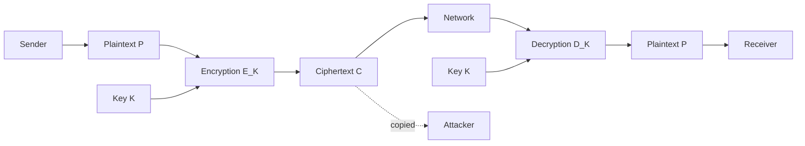

# 03 — Network Security Model

Once the basic terms were clear, I put them into one communication flow: a Sender wants to send protected information to a Receiver, but the path between them may be visible to an Attacker.

I kept the same notation:

```text
P = Plaintext
K = Key
E = Encryption
C = Ciphertext
D = Decryption
```

---

## 1. Sender to Receiver

The Sender starts with plaintext `P` and encrypts it using key `K`:

```text
C = E_K(P)
```

The ciphertext `C` travels through the network.

The Receiver gets `C` and decrypts it using the required key `K`:

```text
P = D_K(C)
```



---

## 2. The question I had here

At first the flow looked simple:

```text
Sender → Receiver
```

But that skips the part that matters in security: the network in the middle may not be trusted.

So I rewrote the picture like this:

```text
Sender
  │
  │ C
  ▼
================ Network ================
             │
             │ Attacker copies C
             ▼
          Attacker
==========================================
  │
  ▼
Receiver
```

Then my question became:

> If the Attacker gets `C`, what else would be needed to recover `P`?

---

## 3. What the Attacker may already know

I do not assume that the Attacker knows nothing.

The Attacker may know:

```text
C = captured ciphertext
E = how the encryption algorithm works
```

The Attacker may still be missing:

```text
K = secret key
P = original plaintext
```

So I keep this model:

```text
Known or observable: E, C
Secret or unknown:   K, P
```

That also fixed one wrong assumption I had earlier: hiding the algorithm itself is not the main protection. A cryptographic system should not fall apart just because the Attacker knows how `E` works.

---

## 4. Key space

Then I reached the idea of **key space**.

The key space is the set of all possible values that `K` could take.

For a toy 3-bit key:

```text
000
001
010
011
100
101
110
111
```

So there are:

```text
2^3 = 8 possible keys
```

For an `n`-bit key:

```text
Key space size = 2^n
```

Examples:

```text
3-bit  → 2^3  = 8
8-bit  → 2^8  = 256
16-bit → 2^16 = 65,536
```

One wording correction mattered here:

```text
The Attacker does not copy the key space.
```

The Attacker may copy `C`. The key space is simply the set of possible `K` values that already exists for the system.

---

## 5. Then I tried the Attacker's approach

If the Attacker has `C` but not `K`, one possible approach is to try candidate keys.

```text
K1 → D_K1(C) → candidate result
K2 → D_K2(C) → candidate result
K3 → D_K3(C) → candidate result
...
```

The Attacker then checks whether one result looks like the expected plaintext.

That is the basic idea of **brute-force key search**.

```text
Captured C
    ↓
Try a candidate K
    ↓
Decrypt C
    ↓
Does the result look like P?
    ↓
If not, try another K
```

For a toy system with four keys:

```text
K = 00
K = 01
K = 10
K = 11
```

an Attacker can test:

```text
D_00(C)
D_01(C)
D_10(C)
D_11(C)
```

This is obviously tiny, but it made the idea clear before moving to larger key spaces.

---

## 6. Encryption is not the whole of network security

Another thing I had to separate was secrecy from every other security problem.

An Attacker may try to:

```text
read C
modify C
replace C
replay C
pretend to be the Sender
block communication
```

So encryption mainly connects to confidentiality. Other attacks may need other services and mechanisms.

That links back to the OSI security architecture:

```text
Attack
  ↓
Required security service
  ↓
Security mechanism
```

For example:

```text
Attacker wants to read P
        ↓
I need confidentiality
        ↓
Encryption may be one mechanism
```

---

## 7. The Attacker questions I keep using

From this point onward, whenever I study a cipher or security method, I ask:

```text
What does the Attacker see?
Does the Attacker have C?
Does the Attacker know E?
What is still secret?
How large is the key space?
Can candidate K values be tested cheaply?
Can the Attacker modify or replay C?
How would the Attacker know a guessed P is correct?
```

That is the same set of questions I carry into classical cryptography.