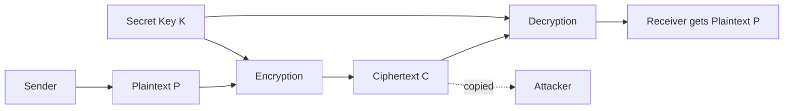
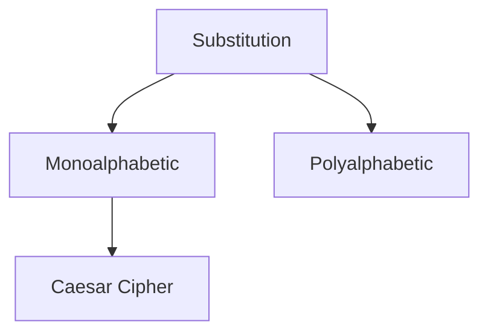

# 04 — Classical Cryptography: Caesar Cipher

When classical cryptography started in class, the first thing I fixed in my head was that, for now, I am working only with **symmetric encryption**.

That means the Sender and Receiver use the same secret key `K` in the basic model:

```text
C = E_K(P)
P = D_K(C)
```

I am keeping public-key cryptography out of this topic because it was not what we were working with here.

---

## 1. Why symmetric encryption here?

The classical ciphers I am starting with are shared-secret methods.

```text
Sender has K
Receiver has K
Attacker should not have K
```

The basic flow is still the same one I used earlier:



---

## 2. Then I came across two different ideas: substitution and transposition

At first both sounded like “changing the message,” but the change is not the same.

### Substitution

In **substitution**, I replace a symbol with another symbol.

Example:

```text
P = HELLO
C = KHOOR
```

The positions are still in the same order, but the letters have been replaced.

So I remember substitution as:

```text
replace
```

### Transposition

In **transposition**, I keep the symbols but rearrange their positions using a permutation.

Example:

```text
P           = ABCDE
Positions   = 12345
Permutation = 31524
C           = CAEBD
```

No new letters were introduced. Their positions changed.

So I remember transposition as:

```text
rearrange
```

| Question | Substitution | Transposition |
|---|---|---|
| What mainly changes? | Letter/symbol identity | Position |
| Are symbols replaced? | Yes | No |
| Are positions rearranged? | Not as the main operation | Yes |

---

## 3. Inside substitution: monoalphabetic and polyalphabetic

The next split was inside substitution itself.



### Monoalphabetic substitution

In a monoalphabetic substitution, one fixed substitution mapping is used throughout the message.

If:

```text
A → D
```

then every `A` under that same mapping becomes `D`.

That repetition later becomes useful to the Attacker because language patterns are not completely hidden.

### Polyalphabetic substitution

In a polyalphabetic system, more than one substitution alphabet can be used.

So the same plaintext letter does not always have to become the same ciphertext letter.

Conceptually:

```text
A → D
A → Q
A → L
```

The actual replacement depends on the cipher and the key. I am not going deeper into a specific polyalphabetic cipher here because that has not been the current class topic.

---

# 4. Caesar cipher

Then we came to the **Caesar cipher**.

The idea was much simpler than the name makes it sound: shift every plaintext letter by the same number of positions in the alphabet.

That shift is the key `K`.

```text
K ∈ {0, 1, 2, ..., 25}
```

If I count `K = 0`, there are 26 possible shifts. If I exclude the no-change case, there are 25 non-trivial shifts.

---

## 5. I first numbered the alphabet

```text
A  B  C  D  E  F  G  H  I  J  K  L  M
0  1  2  3  4  5  6  7  8  9 10 11 12

N  O  P  Q  R  S  T  U  V  W  X  Y  Z
13 14 15 16 17 18 19 20 21 22 23 24 25
```

For one letter inside the message I use:

```text
P_i = numeric value of one plaintext letter
C_i = numeric value of one ciphertext letter
```

The full message notation still stays:

```text
C = E_K(P)
P = D_K(C)
```

---

## 6. Caesar encryption

For each plaintext letter:

```text
C_i = (P_i + K) mod 26
```

I asked why `mod 26` was there. The answer is that the alphabet has 26 positions, so after `Z` I need to wrap back to `A`.

### Example

Take:

```text
P = ATTACKATDAWN
K = 3
```

For the first letter:

```text
A = 0
C_1 = (0 + 3) mod 26
    = 3
    = D
```

For `T`:

```text
T = 19
C_2 = (19 + 3) mod 26
    = 22
    = W
```

Doing the same thing for every letter gives:

```text
P = ATTACKATDAWN
K = 3
C = DWWDFNDWGDZQ
```

So:

```text
C = E_3(P)
```

### The wrap-around case

This is where `mod 26` became obvious to me.

```text
P = XYZ
K = 3
```

For `X`:

```text
X = 23
(23 + 3) mod 26
= 26 mod 26
= 0
= A
```

So:

```text
XYZ → ABC
```

---

## 7. Caesar decryption

To reverse the shift, I subtract the same key:

```text
P_i = (C_i - K) mod 26
```

Example:

```text
C = DWWDFNDWGDZQ
K = 3
```

For `D`:

```text
D = 3
P_1 = (3 - 3) mod 26
    = 0
    = A
```

For `W`:

```text
W = 22
P_2 = (22 - 3) mod 26
    = 19
    = T
```

Continuing gives:

```text
P = ATTACKATDAWN
```

So:

```text
P = D_3(C)
```

---

## 8. Then I asked: if Caesar is this simple, how does the Attacker break it?

This was the point where the Attacker view became more interesting.

Suppose the Attacker captures:

```text
C = KHOOR
```

and knows that Caesar cipher is being used, but does not know `K`.

The Attacker does not need anything clever first. The key space is tiny.

### Brute force comes first

The Attacker can try every shift:

```text
K = 1 → JGNNQ
K = 2 → IFMMP
K = 3 → HELLO
K = 4 → GDKKN
...
```

When `K = 3`, the output becomes readable.

```text
P = HELLO
K = 3
```

So for Caesar, brute force is the first attack I would try.

---

## 9. Then frequency analysis made sense

The next question I had was:

> Why can an Attacker learn anything from how often encrypted letters appear?

The answer comes from the fact that English letters do not occur equally often.

For example, letters such as `E`, `T`, `A`, `O`, `I`, and `N` tend to appear more often than letters such as `Q`, `Z`, `J`, and `X` in normal English text.

Caesar keeps a one-to-one fixed shift. That means the frequencies move to different letters, but the shape of the distribution is still there.

### Approximate English letter frequencies

These are reference values, not fixed laws. A short message can look very different.

| Letter | Approx. % | Letter | Approx. % |
|---|---:|---|---:|
| A | 8.17 | N | 6.75 |
| B | 1.49 | O | 7.51 |
| C | 2.78 | P | 1.93 |
| D | 4.25 | Q | 0.10 |
| E | 12.70 | R | 5.99 |
| F | 2.23 | S | 6.33 |
| G | 2.02 | T | 9.06 |
| H | 6.09 | U | 2.76 |
| I | 6.97 | V | 0.98 |
| J | 0.15 | W | 2.36 |
| K | 0.77 | X | 0.15 |
| L | 4.03 | Y | 1.97 |
| M | 2.41 | Z | 0.07 |

A rough order I keep in mind is:

```text
E T A O I N S H R ...
```

I do not treat that order as a direct decryption formula. It is only a clue.

---

## 10. One frequency-analysis example

Suppose the most common ciphertext letter is:

```text
H
```

I make a first guess that it might correspond to plaintext `E`.

```text
H = 7
E = 4
```

For Caesar, that gives a candidate shift:

```text
K = (7 - 4) mod 26
  = 3
```

Then I test `K = 3` on the full ciphertext and see whether the result looks like meaningful plaintext.

For a short ciphertext this guess can easily be wrong, so I also look at repeated letters, words, context, and other likely mappings.

---

## 11. The weaknesses I can now see in Caesar

After working through both the Sender and Attacker sides, the problems are pretty direct:

```text
1. The key space is tiny.
2. The same shift is used for every letter.
3. Repeated plaintext patterns remain repeated patterns in C.
4. Language statistics are still visible after the shift.
```

That is why I use Caesar here to understand the mechanics and the Attacker's reasoning, not as secure encryption.

---

## 12. Try it instead of only reading it

I am keeping the interactive version as a guided browser lab rather than expecting someone to download an HTML file and figure out the controls.

The lab lets me switch between two views:

```text
Learner view
→ choose P and K
→ calculate C = E_K(P)
→ inspect each letter

Attacker view
→ start only with C
→ try candidate K values
→ compare possible plaintexts
```

The frequency-analysis lab also lets me paste text and see the measured frequencies rather than manually counting every letter like a person being punished in 1840.

The site files are under [`../docs/`](../docs/).